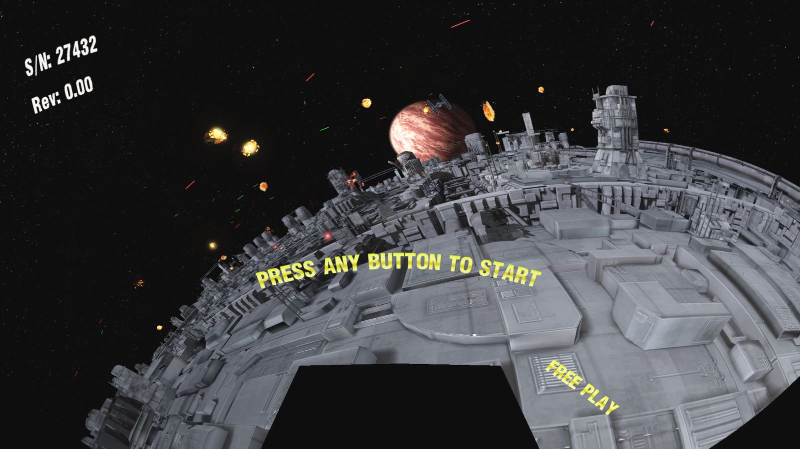

# systemes3recomp

```
  ###  #   #   ###  #####  ###  #   #     ###  ####   ####
 #      #   # #       #   #     ## ##    #     #      #
  ###    # #   ###    #   ###   # # #    ###   ####   ###
     #    #       #   #   #     #   #       #      #     #
  ###     #   ####    #    ###  #   #    ###   ####   ####

 Static Recompilation Toolkit for Namco System ES3 Arcade Games
```

> A System ES3 is a 2013 PC in an arcade cabinet. The game is a 32-bit Windows
> executable that calls kernel32 and Direct3D. So don't emulate the board —
> recompile the executable and hand it the libraries it already wanted.

**[Join the sp00nznet recomp Discord](https://discord.gg/CRpzGWZFcu)** — the
community hub for sp00nznet's recomp projects.

**Current version: v0.1.0.** The pipeline runs end to end against *Mario Kart
Arcade GP DX*: the whole game builds to a native executable, boots through the
cabinet's startup sequence with no error filed, and renders in full 3D at
1360x768 — with **all 495 imports** answered by real DLLs, the cabinet's own
camera and JVS libraries included.

**And it is played, not watched.** A race on a gamepad: pick a character,
pick a track, steer, use items, win. The steering took longer than the
renderer did — the wheel value was correct for days while the game quietly
discarded it in favour of a cabinet counter that nothing here drives.


*Donkey Kong, lap 2/2, first place, on a pad. Not attract mode.*

**What is not finished.** The pedals: an XInput pad reports both triggers on
one DirectInput axis, so the game cannot tell accelerator from brake and
races run on the cabinet's own auto-accel. And the in-race camera sometimes
hangs at the moment it presents the player — intermittently, not every race,
and the race carries on behind it when it does. Both are measured and neither
is guessed at — see the game project's commit log.

**And it is not one title.** *Star Wars: Battle Pods* renders its attract mode
through the same toolkit — a second ES3 game, a different engine, the same
lifted CPU and the same answers for the cabinet's hardware.



*Battle Pods, attract mode. TIE fighters, turbolaser fire and a Death Star
surface, out of the recompiled executable's own swap chain.*

Getting the last of the way there was three missing instructions hiding behind
one misread number — see [Where it stops](#where-it-stops-now) and
[Status](#status).

---

## What is this?

Namco's System ES3 (2013) is what happened after Sega's Lindbergh: an arcade
board that is a commodity Intel desktop, a commodity NVIDIA card, and Windows
Embedded running a Win32 application that Visual Studio 2010 built. See
[docs/hardware.md](docs/hardware.md).

That makes it an unusually good static recompilation target, for a reason worth
saying out loud: **the host is the machine.** There is no CPU to model — the
desktop you are reading this on is the same x86-32. There is no GPU to
emulate — the game wants Direct3D 9 and 10, and those still exist. There is no
operating system to reimplement — `CreateFileW` is `CreateFileW`.

What is left is the game's own code, which is what a static recompiler is for,
and four pieces of arcade hardware that a desktop does not have. Those four are
the honest remainder and they are [documented](docs/board-io.md) rather than
hand-waved.

This toolkit is **title-agnostic**. Everything it knows about a game it learns
from that game's executable.

## The pipeline

```
        YOUR GAME TREE
              |
              v
   +----------------------+   PE32 sections, entry point, the IAT, the
   |  1. Read the PE      |   relocations. pcrecomp's tools/pe/.
   +----------------------+                           WORKS
              |
              v
   +----------------------+   The binary is stripped. Recursive descent from
   |  2. Find the         |   the entry point, plus prologue and data-pointer
   |     functions        |   scans. pcrecomp's tools/disasm/.     WORKS
   +----------------------+   Slow, and the least exact step. 28,597 found.
              |
              v
   +----------------------+   x86-32 -> C, one C statement per instruction,
   |  3. Lift to C        |   reloc-aware so absolute addresses survive.
   +----------------------+   pcrecomp's tools/lift/.             WORKS
              |
              v
   +----------------------+   Derive the stack purge for every import, from
   |  4. Resolve the      |   the SDK, the mangling, or the callee's own
   |     imports          |   `ret N`. pcrecomp's tools/pe/.       WORKS
   +----------------------+                            489 of 495
              |
              v
   +----------------------+   Map the image where it was linked, point the
   |  5. Link the runtime |   IAT at us, hand the rest to Windows.
   +----------------------+   src/runtime/         455 of 495 answered
              |
              v
        NATIVE EXECUTABLE
```

### Almost none of this is ours

Steps 1 to 4 are [**pcrecomp**](https://github.com/sp00nznet/pcrecomp), the
shared PC toolbox, vendored here as a git submodule. One PE parser, one x86-32
lifter, one function-recovery pass — shared with every PC-era target rather
than forked per platform, so a fix to `adc` helps System ES3 and *Fury³* at
once.

There is no lifter subclass in this repo at all, which is one fewer than
[lindberghrecomp](https://github.com/sp00nznet/lindberghrecomp) needed. A Linux
ELF reaches its libraries through PLT stubs and the lifter cannot see through
those, so Lindbergh had to teach it. A PE reaches them through the IAT — an
indirect call through a data slot — and the stock lifter already emits exactly
the right thing:

```c
{ uint32_t _ct = rd32(GVA(0x0081D068)); push32(c, 0x004A12C7u); dispatch(c, _ct); }
```

So the boundary is drawn at load time instead. `guest_load()` writes a sentinel
address into every IAT slot and `dispatch()` routes that range to `hle_call()`.
That is not just less code — it catches every way an import can be reached, not
only a direct `call [__imp_X]`: the `jmp [__imp_X]` thunks MSVC emits, a
pointer copied out of the IAT and called much later (the CRT does this), and
the vtables Direct3D and the OKAO libraries hand back. A lifter-side pattern
match sees the first and misses the rest.

### What we gave back

This project is the first thing to run pcrecomp's whole PC pipeline over a
whole stripped game, and that found a lot. All of it was fixed **upstream in
[pcrecomp](https://github.com/sp00nznet/pcrecomp)** rather than here, which is
the shape a good change to any of these projects takes.

**A function's extent was not clamped to the next function.** `func.end` comes
out of recursive descent as `max(block.end)`, and descent follows unconditional
jumps — so one `jmp` to a shared epilogue puts the end far past the body and
everything in between is counted as part of this function. The lifter then
reads `size` bytes *linearly*, so it lifts all of them, inside this function,
again. Measured here: **28,597 functions claiming 89.5 MB of bodies for a
4.3 MB code range**, 271 of them over 64 KB and one at 1.3 MB, which lifted to
1.9 GB of C. That is not a coverage problem, it is the same code twenty times
over, and no compiler will take it. `clamp_extents()` brings the claim to
6.7 MB and the output to 2.1 million lines.

**And a body cut mid-function returned instead of transferring.** Falling off
the end of a lifted extent is a real control transfer on x86; the generated C
reached its closing brace and returned, skipping the `ret` that never ran and
leaving esp four bytes low. Nothing faults and every value the caller reads
afterwards is one slot out. Now it emits `dispatch(c, <end>); return;`, which
is what the fallthrough *is* — dead code in a correctly-sized function, and the
reason clamping is safe.

**`fucom` was 81% of the remaining gap.** Of 50,555 instructions the lifter
could not express, 40,796 were `fucompp` and 7,450 more were `fucomp` — one
mnemonic was most of it. They were missing because only `fcom`/`fcomp`/`fcompp`
were listed, and `fucom` is the *same comparison*: the two differ only in which
NaNs raise an invalid-operation exception, which this model does not raise at
all. Which made the omission worse than it looks, because the unordered forms
are the common ones — MSVC emits `fucompp; fnstsw ax; test ah` for an ordinary
float comparison in C. Coverage went from 99.73% to **99.97%**.

**Three instructions killed the lift outright**, each ending the whole run with
a traceback: `repz ret` (AMD's branch-prediction idiom for a plain `ret`, which
MSVC puts at every branch target that returns), `jmp fword ptr` far pointers,
and `fld tbyte` / `fldenv`, which were silently read as 64-bit doubles.

**Reading a stack purge off the callee's own `ret N`.** Every shim has to pop
exactly what the real function popped; get one wrong and the guest stack
silently desynchronises. Every existing strategy read the count off a *name*,
and names run out exactly where an arcade port gets interesting: OKAO Vision
exports by ordinal only, and its DLLs exist nowhere but in a game tree. But the
count is also in the callee — so `stdcall_argc.py` now disassembles the export
and reads it. Checked against the Windows SDK import libraries over every
export where both have an answer: **1,307 agree, 2 disagree.** On this import
table it took 449 of 495 resolved to **489 of 495**.

**Moving the x87 stack across the lifted/real boundary.** `hybrid_regs` is the
integer registers, which is the whole ABI for almost every call — except that a
function returning `float` returns it in `st(0)`, and MSVC's `_CIpow` /
`_CIsqrt` / `_CIsin` family takes its arguments in `st(0)`/`st(1)` and nothing
on the stack at all. *Mario Kart* imports nine of those. `hybrid_fpu_push` /
`pop` / `depth` / `clear`, and the depth is what lets the *result* side need no
table of which functions return floats: a callee that returned one is exactly a
callee that left the stack one deeper than it found it.

## Status

Three System ES3 titles are through the pipeline, which is the claim this
toolkit is actually making: nothing it knows about a game comes from anywhere
but that game's executable.

| title | | |
|---|---|---|
| **Mario Kart Arcade GP DX** (2013) | x86, 495 imports | **Played.** Coin in, pick a character and a track, steer, use items, win a race — on a gamepad. [Bring-up notes](docs/mariokartdx-notes.md) |
| **Star Wars: Battle Pods** (2014) | x64, 609 imports | **Renders its attract mode.** A different engine on the same lifted CPU |
| **MachStorm** (2014) | x86, 254 imports | **Boots through the CRT into its own code.** Stops at a null interface where Direct3D would be |

The corpus itself was measured rather than guessed at:
`tools/corpus/es3_triage.py` reads a TeknoParrot dump and reports what each
build imports, which is how MachStorm was picked second — 254 imported
functions against Mario Kart's 495 and Tekken 7's 1137.

### What the pipeline does, on the title it has been pushed hardest against

*Mario Kart Arcade GP DX* v1.00.32 — 5.8 MB, PE32, `i386`, built 2013-04-23.

| | |
|---|---|
| PE parsing | **Works.** Verified against four builds spanning 2013–2022. 495 imports across 27 DLLs, 108,414 relocations. |
| Function recovery | **25,757 real ones**, by recursive descent — the binary is stripped. A first pass found 28,597; 2,526 were addresses inside instructions. 2,586 branch targets had to be *added*, because clamping a function at a shared epilogue leaves its second half unreachable. |
| Lifting | **29,645 functions into 75 translation units**, none failing outright. More than the catalog holds, because the driver closes what the *generated text* dispatches to, round after round — which the catalog cannot know, some of those addresses being the lifter's own arithmetic. |
| Instruction coverage | **Complete for every path these games take.** Everything they stopped on went upstream into pcrecomp: the x87 transcendentals, then the packed SSE families — shifts with x86's saturation where C is undefined, the packed integer set, the compares, pack/unpack — and `fld tbyte`, the ten-byte format an x87 register really has. What is left unlifted is overwhelmingly data the recovery pass mistook for code. |
| Imports | **495 of 495** resolved against real DLLs from a game tree, the cabinet's own included: the OKAO Vision camera and `JVSEmuMK.dll` ship with the game. |
| The board | Answered by the runtime, not emulated: JVS I/O, the card reader, All.Net, the USB I/O board. See [docs/board-io.md](docs/board-io.md). |

## Use

```powershell
git clone --recursive https://github.com/sp00nznet/systemes3recomp
cd systemes3recomp

# what the executable asks the board for
py -3.11 -m tools pe MK_AGP3_FINAL.exe

# recover its functions. Half an hour on a 4 MB .text - run it once and keep
# the catalog; every later step reads it.
py -3.11 -m tools scan MK_AGP3_FINAL.exe catalog.json

# lift it - minutes, not hours
py -3.11 -m tools recomp MK_AGP3_FINAL.exe catalog.json gen\

# the checks
py -3.11 tools\recomp\test_driver.py
py -3.11 pcrecomp\tools\pe\stdcall_argc.py --selftest
py -3.11 pcrecomp\tools\disasm\disasm32.py --selftest
cmake -S . -B build -A Win32; cmake --build build --config Release
ctest --test-dir build -C Release
```

Needs Python 3.11 with `capstone` and `pefile`, and a 32-bit MSVC toolchain.

Neither the 32-bit part nor the MSVC part is negotiable. The CPU model is flat
— a guest register holds a real host address — and the game maps at
`0x00400000`, which only exists as an address in a 32-bit process. MSVC because
the lifted/real boundary is x86 `__asm`, and because handing the game the
host's own kernel32 needs a Windows host to hand it. The CMake refuses both
rather than let you find out later.

## Layout

```
tools/
  pcrecomp.py   load the shared toolbox out of the submodule
  recomp/       the ES3 end: catalog -> lifted C, and the generated headers
src/runtime/
  guest.c       map the PE where it was linked, point the IAT at us
  dispatch.c    original address -> lifted function, sentinels on the way past
  hle.c         the import registry and the stack unwind
  hle_native.c  forward to the host's own DLL - which is most of the table
  hle_board.c   the parts of the cabinet that are not a PC
pcrecomp/       the PE tools, the lifter and the boundary (git submodule)
docs/
  hardware.md   what a System ES3 is, read off the binaries
  board-io.md   JVS, the card reader, the camera, authentication - measured
```

## Legal

MIT, and original work throughout. **No game data, no keys, and no
circumvention of anything.** The tools here read a PE's own headers and
translate x86 machine code you supply. System ES3 titles are © their
publishers; this is an independent, non-commercial preservation project.
